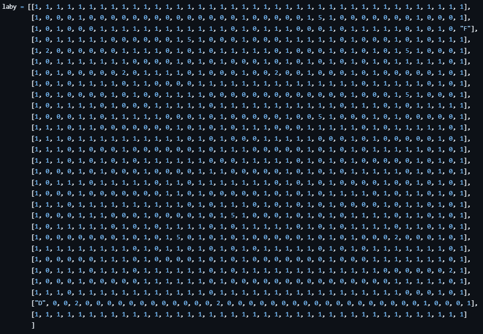
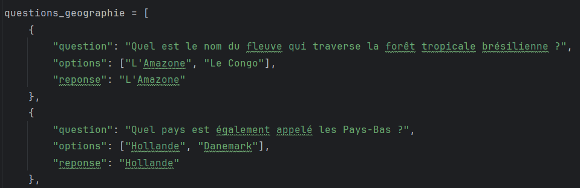

# Analyse

## TAD : Types Abstraits de Données

### Arbres

L'**arbre** permet de modéliser le labyrinthe. Chaque intersection (noeud) correspond à une question qui mène vers deux arretes. Ces dernières dépendent du choix fait pas la joueur. Une seule branche permet de sortir du labyrinthe : c'est celle qui est associé aux bonnes réponses.

### Piles, dictionnaires et listes

Une **pile** est utilisée pour mémoriser l'historique des questions et des positions du joueur. Lorsqu'il arrive dans un cul-de-sac, on dépile pour le ramener à l'état précédent.

La **matrice** (pour la version graphique) permet de réprésenter les murs du labyrinthe et ses éléments. Chaque caractère représente un état.
- 0 = chemin
- 1 = mur
- 2 = question
- 5 = retour
- D = début
- F = fin

  

Les **dictionnaires** nous sont très utiles. Nous les utilisions pour la base de données des questions ainsi que pour lier les coordonnées du labyrinthe à la logique d'arbre de notre jeu.

  

Nous utilisons aussi des listes : gestion des monstres, deplacement joueur, directions, etc.

---

## POO : Progammation Orientée Objet

### Affichage graphique (`affichage.py`)

#### Type de données : Game

- Attributs : longueur, largeur, ecran, running, carte, joueur, monstres, accueil, coordonnees_question, jeu_en_cours, noeud, chemin

- Méthodes : masque, run (méthode principale du jeu)

#### Type de données : Joueur

- Attributs : pacmans, x_perso, y_perso, pacman, indice, vies, bille, attaque_monstre_enregistrement

- Méthodes : afficher, subir_attaque, victoire, defaite

#### Type de données : Monstre

- Attributs : points, x, y, en_vie, directions, direction, enregistrement_temps, monstres, monstre

- Méthodes : subir_attaque, choix_deplacement, deplacement, afficher

#### Type de données : BilleAttaque

- Attributs : x, y, direction, attaque, enregistrement_temps

- Méthodes : lancer, deplacement, afficher

#### Type de données : Arbre

- Attributs : type_question, noeuds, racine

- Méthodes : creer_arbre

#### Type de données : Question

- Attributs : coordonnees, profondeur, bon_chemin, mauvais_chemin, choixA, choixB, bonne_touche, question, enfants

- Méthodes : melange_choix

#### Type de données : Menu

- Attributs : etape, affiche_accueil

- Méthodes : afficher_regles, afficher_indications, afficher

#### Type de données : Carte

- Attributs : ecran, affiche_question, affiche_retour

- Méthodes : afficher, afficher_question, afficher_retour 

### Affichage textuel (`labyrinthe.py`)

#### Type de données : Noeud

- Attributs : question, options, reponse, droite, gauche, parent

#### Type de données : Arbre

- Attributs : type_questions, profondeur_max, racine

- Méthodes : creer_arbre 

#### Type de données : Labyrinthe

- Attributs : arbre, noeud_courant, profondeur_courante, temps_depart, difficulte, retour_facilite, noeuds_erreurs, chemin

- Méthodes : options_possibles, reponse_valide, peut_jouer, afficher_question, victoire 

