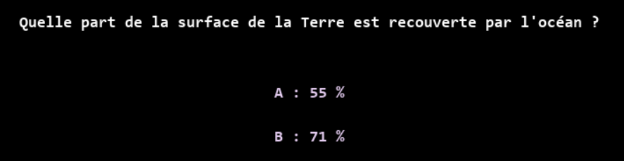
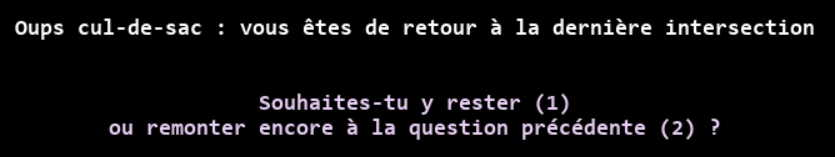

# Cahier des charges

Jeu de vitesse et d'énigme (quiz de questions): le joueur se retrouve dans un labyrinthe et doit utiliser ses connaissances pour trouver son chemin.

---

## Objectifs

Le joueur doit trouver la sortie du labyrinthe dans un temps imparti (500 secondes) tout en survivant aux attaques des monstres qui se baladent dans le labyrinthe.

---

## Règles du jeu

Le joueur se déplace dans les couloirs et rencontre des intersections.

À chaque intersection, une question s'affiche. Le joueur doit répondre par A ou B pour avancer. 

Une bonne réponse mène vers la sortie, une mauvaise mène forcèment vers un cul-de-sac.

En cas de cul-de-sac, le joueur peut utiliser une option de retour pour revenir à l'intersection précédente. 

Le joueur possède 3 vies. Entrer en contact avec un monstre fait perdre une vie.

La partie est perdue si le compteur de temps tombe à zéro ou si les 3 vies sont perdues.

---

## Personnages

Le **joueur** : 
- se déplace 
- répond aux questions pour avancer
- peut faire demi-tour 
- peut tirer des billes d'attaque pour se défendre

Le **monstre** : 
- se déplace aléatoirement dans le labyrinthe toutes les secondes
- il fait perdre 1 vie quand il entre en contact avec le joueur

---

## Actions possibles

- `haut` / `bas` / `gauche` / `droite` : pour se déplacer sur le labyrinthe 

- touches `A` et `B` : pour répondre aux questions 

  

- Barre `espace` : pour attaquer les monstres avec des billes 

- touches `1` et `2` : pour rester ou pour remonter à la question précédente lorsque l'on attérit dans un cul de sac

  

