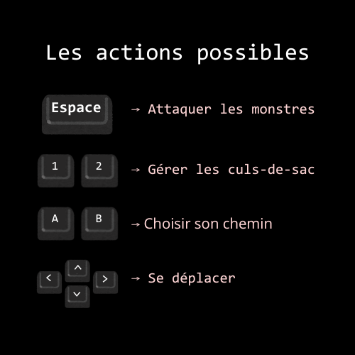
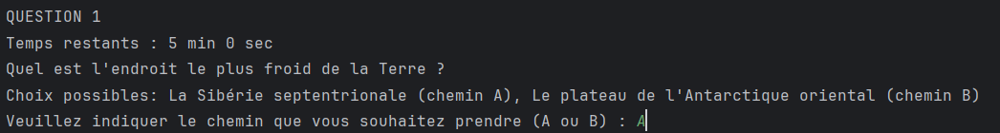

# Cahier des charges

Jeu de vitesse et d'énigme (quiz de questions): le joueur se retrouve dans un labyrinthe et doit utiliser ses connaissances pour trouver son chemin. Nous avons créé deux versions du jeu : une première version qui se joue avec la *console* (version **textuelle** : Escape-Quiz) et une version qui se joue avec *Pygame* (version **graphique** : Quiz-Man).

---

## Objectifs

Le joueur doit trouver la sortie du labyrinthe en un certain temps, grâce aux questions qui vont le guider dans ses choix.

- Pour la version graphique, il doit sortir en 2 minutes tout en survivant aux attaques des monstres qui se baladent dans le labyrinthe.

- Pour la version textuelle, le joueur a plus ou moins de temps et une aide selon le choix de difficulté qu'il fait au début du jeu.

---

## Règles du jeu

Le joueur se déplace dans les couloirs et rencontre des intersections.

À chaque intersection, une question s'affiche. Le joueur doit répondre par A ou B pour avancer. 

Une bonne réponse mène vers la sortie, une mauvaise mène forcément vers un cul-de-sac.

### En plus pour la version graphique

Le joueur possède 1 seule vie. Entrer en contact avec un monstre fait perdre une vie, donc entraîne sa mort directement.

Le temps du jeu est de maximum 2 minutes.

La partie est perdue s'il ne reste plus de temps de jeu ou si la vie du joueur est perdue à cause d'un monstre.

En cas de cul-de-sac, le joueur est ramené à l'intersection précédente. Il a le choix d'y rester ou de continuer de remonter à l'intersection précédente.

### En plus pour la version textuelle

Les niveaux de difficulté : Facile (5 min et un retour facilité) / Moyen ( 2 min et retour facilité) / Difficile (1 min et pas de retour facilité)

- Le retour facilité : En cas de cul de sac, le joueur revient directement à sa première erreur commise lors du jeu.

- Pas de retour facilité : Le joueur doit retrouver par lui-même où il a commis ses erreurs.

---

## Personnages (version graphique seulement)

Le **joueur** : 
- se déplace dans les couloirs
- répond aux questions pour avancer
- peut faire demi-tour 
- peut tirer des billes d'attaque pour se défendre (celles-ci font perdre des points au monstre si les billes les touchent)

Le **monstre** : 
- se déplace aléatoirement dans le labyrinthe toutes les secondes
- il fait perdre 1 vie quand il entre en contact avec le joueur
- il possède des points de vie et meurt s'il ne lui reste plus de points

---

## Actions possibles

### En version graphique

  

- `haut` / `bas` / `gauche` / `droite` : pour se déplacer sur le labyrinthe 

- touches `A` et `B` : pour répondre aux questions 

  

- Barre `espace` : pour attaquer les monstres avec des billes 

- touches `1` et `2` : pour rester ou pour remonter à la question précédente lorsque l'on attérit dans un cul de sac

  

### En version textuelle 

- touches `A` et `B` : pour répondre aux questions 

  

