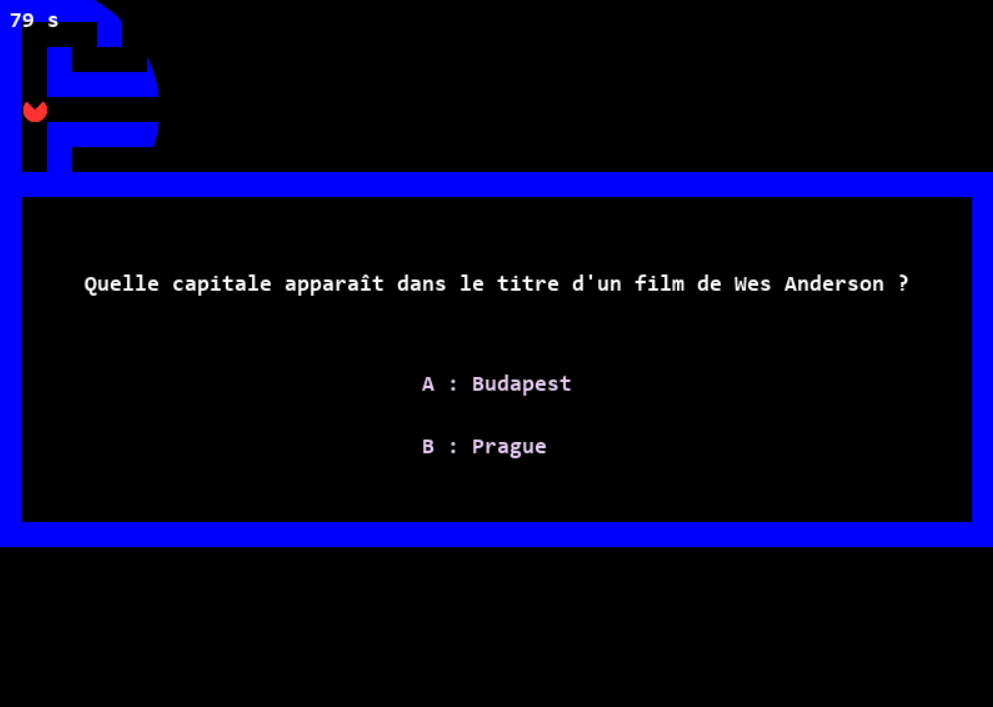

<div align="center">
  
</div>

# Quiz Labyrinthe

Pour réaliser ce jeu, nous avons d'abord commencé par une approche textuelle, puis nous avons réalisé un jeu graphique, plus agréable à jouer. La version textuelle s'appelle **Escape-Quiz**. La version graphique s'appelle **Quiz-Man**.

### Description

Quiz-Man et Escape-Quiz sont des jeux de vitesse et de réflexion.

### Aperçu de l'interface textuel

<div align="center">
  
</div>

### Aperçu de l'interface graphique

<div align="center">
  
</div>

---

## Bibliothèque utilisée

Pour réaliser l'interface graphique, nous avons donc utilisé la bibliotèque Pygame.

---

## Installation 

1. Vérifier que vous avez Python 3

2. Ouvrez un terminal et exécutez la commande suivante : 

```git clone https://github.com/Bertillefz/Projet-Informatique-Evan-Bertille.git```

3. Installez Pygame

```pip install pygame```

## Exécution du programme

Lancez le fichier principal.

- Pour un affichage graphique (conseillé) : ```python3 affichage.py```

- Pour un affichage textuel: ```python3 game.py```

---

## Méthodes de jeu 

Voir `CahierDesCharges.md` (partie `Actions possibles`)

---

## Structure du code 

Voici les différents fichiers de notre code : 

- `question.py` : Base de données des questions.

*Pour l'affichage textuel*
- `game.py` : Ce fichier contient les fonctions principales de l'affichage textuel.
- `labyrinthe.py` : Ce fichier contient les méthodes utiles au jeu.

*Pour l'affichage graphique*
- `affichage.py` : Ce fichier contient l'ensemble des fonctions et classes pour un affichage graphique.

---

#### Par Evan Margotin et Bertille Fernandez