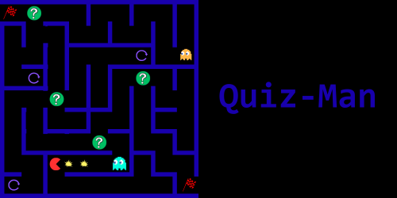

<div align="center">
  
</div>

# Quiz Labyrinthe

Pour réaliser ce jeu, nous avons d'abord commencer par une approche textuel, puis nous avons réaliser le code pour réaliser un jeu graphique.

### Description

Quiz-Man est un jeu de vitesse et de réflexion.

### Aperçu de l'interface textuel


### Aperçu de l'interface graphique


---

## Bibliothèque utilisée

Pour réaliser l'interface graphique, nous avons donc utiliser la bibliotèque Pygame.

---

## Installation 

1. Vérifier que vous avez Python 3

2. Ouvrez un terminal et exécuter la commande suivante : 

```git clone https://github.com/Bertillefz/Projet-Informatique-Evan-Bertille.git```

3. Installez Pygame

```pip install pygame```

## Exécution du programme

Lancer le fichier principal.

- Pour un affichage graphique (conseillé) : ```python3 affichage.py```

- Pour un affichage textuel: ```python3 game.py```

---

## Méthodes de jeu (version graphique)


---

## Structure du code 

Voici les différents fichiers de notre code : 

- `game.py` : Ce fichier contient les fonctions principales de l'affichage textuel.
- `labyrinthe.py` : Ce fichier contient les méthodes utiles au jeu.
- `question.py` : Base de données des questions.

- `affichage.py` : Ce fichier contient l'ensemble des fonctions et classes pour un affichage graphique.

---

#### Par Evan Margotin et Bertille Fernandez